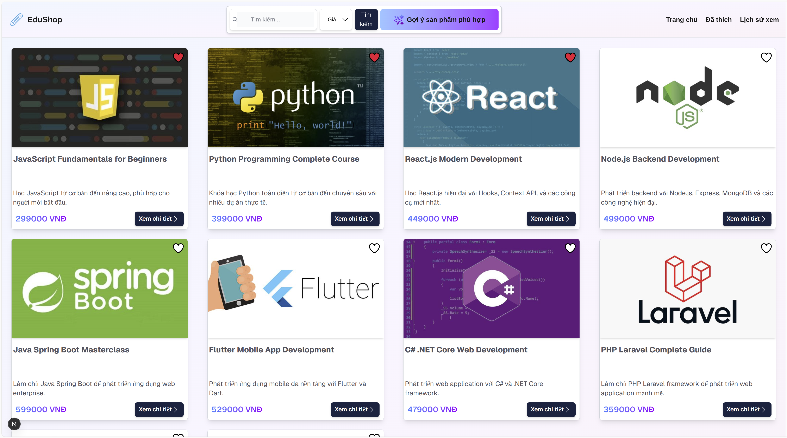
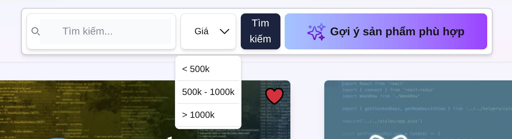
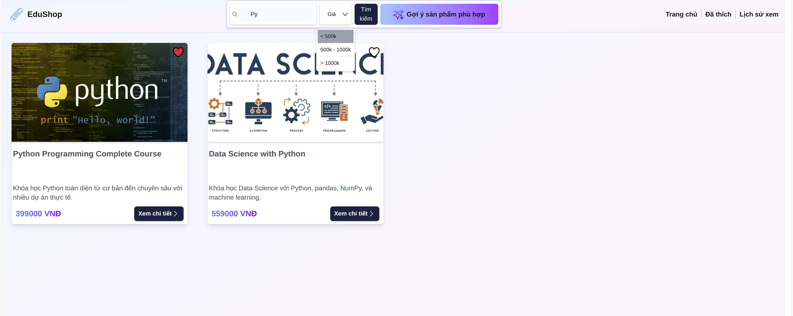
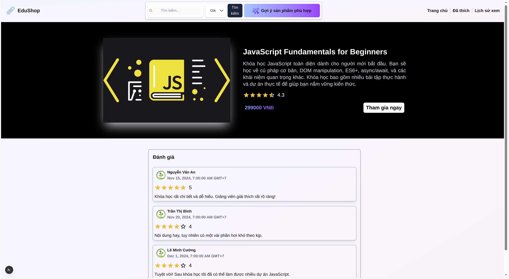
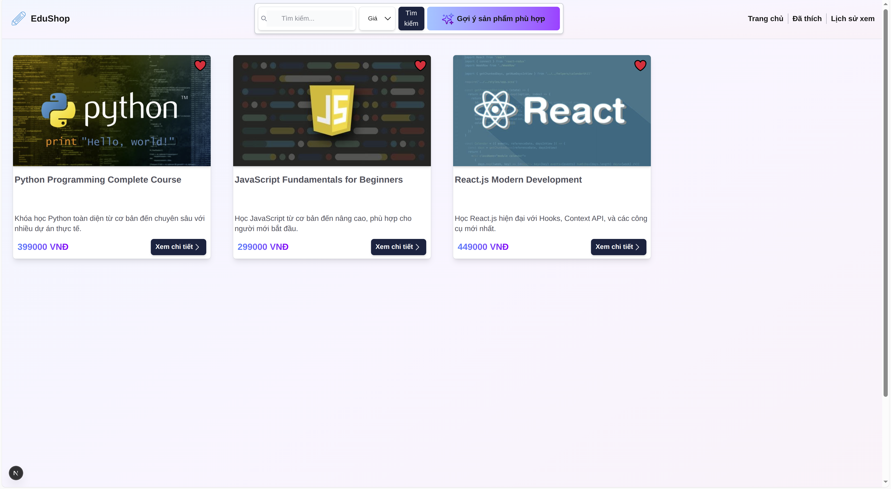
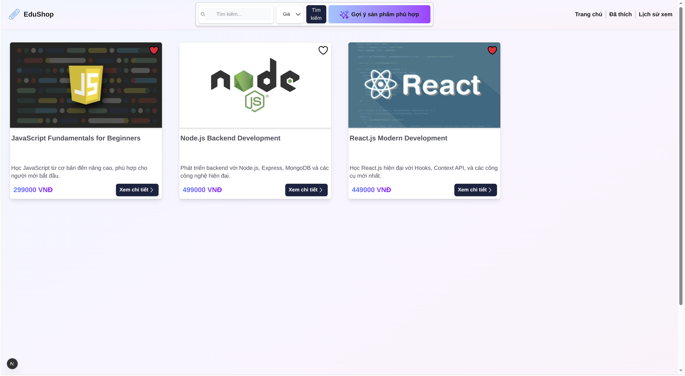

# How to run the project if you want to clone code 

👉 **Step 1: Clone code by github link**
```bash
git clone https://github.com/HuynhDat2002/edu-shop.git
```

👉 **Step 2: Install npm packages**
```bash
npm install
```

👉 **Step 3: Run project in dev enviroment**
```bash
npm run dev
```

👉 **Step 4: Access to project by browser**
```bash
http://localhost:3000
```
👉 **Step: If you want to run build**
```bash
npm run build
```

# Access to project through Vercel
```bash
https://edu-shop.vercel.app/
```


# Interfaces
    Homepage Screenshot


    Search and Filter and Suggestion by AI Screenshot


    Search and Filter Result Screenshot



    Course Details Screenshot


    Liked Courses Screenshot


    History Screenshot

